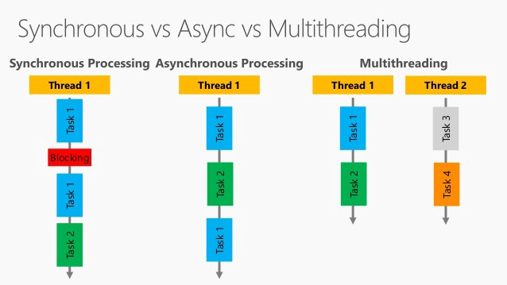

# **node introduction**

node.js est un **asynchronous event-driven JavaScript runtime** qui permet d'éxecuter du code javascript sur votre système d'exploitation.  
Votre code javascript est ainsi executé dans un environement monothread, non bloquant, privilégeant ainsi la programmation d'application suivant une architecture orientée événements (_event driven architecture_).


<br/><br/>

## **command line**

Executer node sur votre ligne de commande vous donne accès au REPL (read-eval-print-loop) qui est interpreteur javascript interactif.

```zsh
% node
Welcome to Node.js v14.10.1.
Type ".help" for more information.
>
```

Vous pouvez ainsi executer du code javascript:

```js
> let name = 'Alyra'
> let msg = `Hello, ${name}`
> console.log(msg)
Hello, Alyra
```

Vous avez aussi accès à une calculatrice intégrée, facilement accessible:

```js
> (3 + 5 + 7) / 5 * 3 ** 10
177147
```

## **Execute javascript files**

_hello.js_:

```js
// hello.js
let name = 'alyra'
for (let i = 0; i < 10; ++i) {
  console.log(`Hello, ${name}`)
}
```

```zsh
% node hello.js
Hello, alyra
Hello, alyra
Hello, alyra
Hello, alyra
Hello, alyra
Hello, alyra
Hello, alyra
Hello, alyra
Hello, alyra
Hello, alyra
```

## **Create a new project**

### **Manually**:

- create a new project on github
- initialize your new project with git:

  ```zsh
  % git init my-project
  ```

- change the working directory to your project:

  ```zsh
  % cd my-project
  ```

- initialize your project with yarn:

  ```zsh
  % yarn init -y
  ```

- add or generate a _.gitignore_ file:  
  Use **.gitignore Generator** for vscode or copy and enhance this template: https://github.com/github/gitignore/blob/master/Node.gitignore

- modify the generated _package.json_:  
  from:

      ```json
      {
        "name": "my-project",
        "version": "1.0.0",
        "main": "index.js",
        "author": "YourName <YourEmail@mail.com>",
        "license": "MIT"
      }
      ```

  to:

  ```json
  {
    "name": "my-project",
    "version": "1.0.0",
    "author": "YourName <YourEmail@mail.com>",
    "license": "MIT",
    "type": "module",
    "exports": {}
  }
  ```

- add dev dependencies **eslint** and **prettier**:

  ```zsh
  % yarn add eslint --dev
  ```

  ```zsh
  % yarn add prettier --dev
  ```

- copy or generate an eslint and a prettier config file:  
  _.eslintrc.json_:

  ```json
  {
    "env": {
      "es2021": true,
      "node": true
    },
    "extends": "eslint:recommended",
    "parserOptions": {
      "ecmaVersion": 12,
      "sourceType": "module"
    },
    "rules": {}
  }
  ```

  _.prettierrc.json_:

  ```json
  {
    "trailingComma": "es5",
    "tabWidth": 4,
    "semi": false,
    "singleQuote": true,
    "arrowParens": "always"
  }
  ```

- update the git index:

  ```zsh
  % git add .
  ```

- create first commit:

  ```zsh
  % git commit -m "First commit"
  ```

- add github remote repository and set the branch:

  ```zsh
  % git remote add origin https://github.com/alyra-student/my-project.git
  % git branch -M master
  ```

- push the first commit:

  ```zsh
  % git push -u origin master
  ```

### **djinit**:

- create a new project on github
- create your project with djinit:

  ```zsh
  % npx djinit my-project
  ```

- change the working directory to your project:

  ```zsh
  % cd my-project
  ```

- add github remote repository and set the branch:

  ```zsh
  % git remote add origin https://github.com/alyra-student/my-project.git
  % git branch -M master
  ```

- push the first commit:

  ```zsh
  % git push -u origin master
  ```

## **configuration: package.json**

https://docs.npmjs.com/files/package.json

## **usefull yarn commands**

Initialize a node.js project:

```zsh
% mkdir my-project
% cd my-project/
% yarn init -y
```

Install a dependency:

```zsh
% yarn add a-package
```

Install a global dependency (not recommended):

```zsh
% yarn global add a-package
```

Install the dependencies defined in a **_package.json_** file:

```zsh
% yarn install
```

Install a dev dependency:

```zsh
% yarn add a-package --dev
```

Upgrade all the dependencies to their latest version:

```zsh
% yarn upgrade
```

Upgrade only one dependency:

```zsh
% yarn upgrade a-package
```

Remove a dependency:

```zsh
% yarn remove a-package
```

Publish a package defined by the **_package.json_** in the current directory:

```zsh
% yarn publish
```

Run scripts defined in your **_package.json_**:  
_package.json_:

```json
{
  "name": "my-package",
  "scripts": {
    "build": "babel src -d lib",
    "test": "jest"
  }
}
```

```zsh
% yarn run test
```

is equivalent to:

```zsh
% yarn test
```

<br />

```zsh
% yarn run build
```

is equivalent to:

```zsh
% yarn build
```
